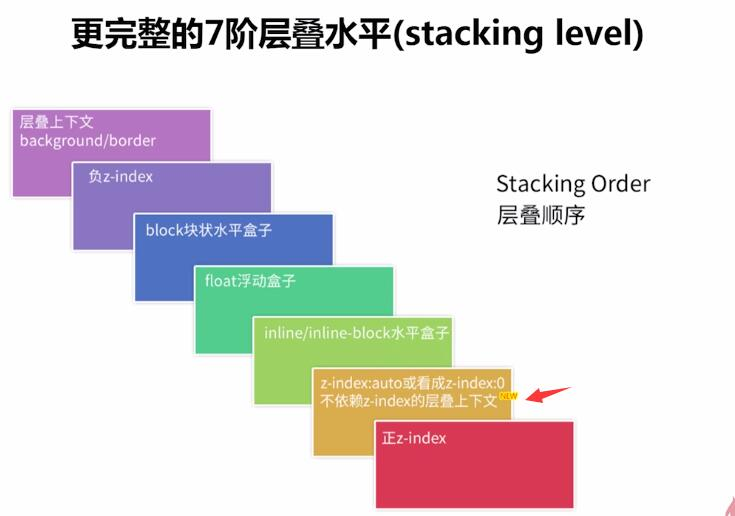
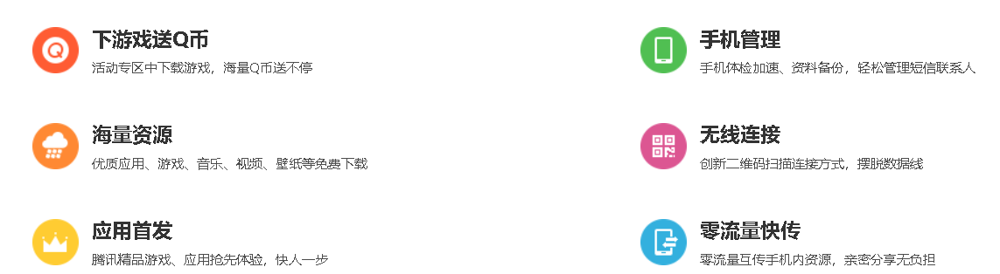

### 1 meta标签的使用

> meta标签必须写在头部head标签之内

- keywords关键字

> keywords关键词，是告诉搜索引擎你的网站或页面内容主要围绕哪些词组展开的，
> 每个关键词不宜过长；有多个关键词的话，尽量将重要的关键词放在前面，次要的往后排

```html

<meta name="keywords" content="web编程,前端开发"/>
```

- content

> description的meta标签,务必要写在keywords的meta标签之后
> description要用简短的文字描述网站或网页的主要内容，有利于各大搜索引擎的抓取收录你的网站或网页。

```html

<meta name="description" content="博客是一个关注网络编程和建站技术的网站,编程行业动态！"/>
```


---

### 2 Z-index

- 表示层级关系,指定一个元素的堆叠顺序。
- 可以有负值
- 仅仅在开启定位的元素上奏效 （position:relative/absolute/fixed/sticky）
- JavaScript 语法： object.style.zIndex="1"
  [慕课讲解z-index](http://www.imooc.com/learn/643)
  
- 遵循“后来居上”和“谁大谁上”的层叠准则
- [博客](https://www.cnblogs.com/benbendu/p/5811534.html)

---

### 3 dl dt dd带有标题的列表的使用



- 左侧的小图标可以采用背景图的方
    - 可以通过 dl:before添加一个元素，设置元素的显示大小，可以容纳下背景图
    - 或者先设置dl的padding-left值，然后设置图标背景，让图标背景左边居中

```html

<dl>
  <dt>海量资源</dt>
  <dd>优质应用、游戏、音乐、视频、壁纸等免费下载</dd>
</dl>
<!--使用dl dt dd 这一组标签，可以专门对dt进行样式设置，
  如果是普通的ul li 那么还要设置class值，进行区分
-->
```    

```css
dl {
  padding-left: 54px;
  background: url("../06-应用宝/img/func1.png") left center no-repeat;
}
```

---

### 4 文本溢出隐藏

```css
.ellipsis {
  white-space: nowrap;
  word-wrap: normal;
  word-break: normal;
  text-overflow: ellipsis;
  overflow: hidden;
}
```

---

### 5 清除浮动 的方式

- 额外标签法（不推荐）
    - 在最后一个浮动标签后，新加一个标签，给其设置clear：both；
    - clear：both：本质就是闭合浮动， 就是让父盒子闭合出口和入口，不让子盒子出来

- overflow不为none （不推荐）
    - 父级添加overflow属性（父元素添加overflow:hidden）
    - 通过触发BFC方式，实现清除浮动
    - 优点：代码简洁
    - 缺点：内容增多的时候容易造成不会自动换行导致内容被隐藏掉，无法显示要溢出的元素

- 使用after伪元素清除浮动（推荐使用） 
  -  伪标签是模拟额外标签法

```css
.clearfix:after {
  content: ".";
  display: block;
  height: 0;
  clear: both;
  visibility: hidden;
  overflow: hidden;
  font-size: 0;
  line-height: 0;
}

.clearfix {
  *zoom: 1; /*ie6清除浮动的方式 *号只有IE6-IE7执行，其他浏览器不执行*/
}
```

- 使用before和after双伪元素清除浮动
    - 缺点：用zoom:1触发hasLayout.

```css
.clearfix:after,
.clearfix:before {
  content: "";
  display: table;
}

.clearfix:after {
  clear: both;
}

.clearfix {
  *zoom: 1;
}
```

--- 
### 6 移动端清除滚动条
```css
::-webkit-scrollbar{
  /* 三种方式都可以*/
  display: none;
  /*width: 0;*/
  /*background: transparent;*/
}
```
----


